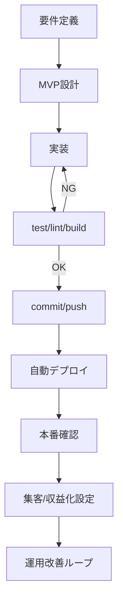

# Reusable Web Launch Playbook

目的: 今後の「0→1でWebサービスを作って公開する」作業を、毎回同じ品質で短時間に回すための汎用手順。

## 1. 要件定義

1. 目的を1文で定義（例: 集客 / 収益化 / 検証）
2. MVP機能を3〜7個に限定
3. 成功指標を設定（公開日、PV、CV、収益）
4. 非機能要件を決める（コスト上限、保守工数、セキュリティ）

## 2. 技術方針

1. 低運用優先なら静的中心（SSG）
2. 動的処理が必要な部分だけAPI化
3. 環境変数で切替（ローカル/本番）
4. 年次更新が必要なデータは外部設定化（JSON/TOML）

## 3. 開発標準

1. 画面実装
2. ドメインロジックを `lib` に分離
3. 最低限のテスト追加
4. `lint/build/test` を通す
5. 個人情報・秘密情報がないか確認

## 4. デプロイ標準

1. Git管理（main運用）
2. ホスティングにGit連携（自動デプロイ）
3. Build command / Output directory を固定
4. 本番環境変数を設定
5. デプロイ完了後に公開URL疎通確認

## 5. 収益化標準（広告モデル時）

1. 広告タグを環境変数で制御
2. `ads.txt` を公開
3. `about` / `privacy` / `contact` を用意
4. 広告審査申請
5. 審査待ち中もサイト更新を継続

## 6. 集客標準

1. 検索意図単位でページ生成（ロングテール）
2. タイトル/説明文テンプレを自動化
3. 内部リンクを自動化
4. sitemap自動生成
5. 構造化データ（FAQ等）追加

## 7. 運用標準

1. 週次: 指標確認（流入、CTR、順位、収益）
2. 月次: 上位ページ改善
3. 年次: 制度/料金/ルール更新
4. 変更は小さく早く出す（毎回デプロイ）

## 8. 自動化標準

1. 反映コマンドを1アクション化（commit→push）
2. 週次レポートを自動生成
3. 年次更新リマインドを自動生成
4. ABテスト結果を継続収集

## 9. 汎用フロー

## 10. 実行ルール

1. まず「最小で出す」
2. 次に「自動化で回す」
3. 最後に「指標で改善する」
